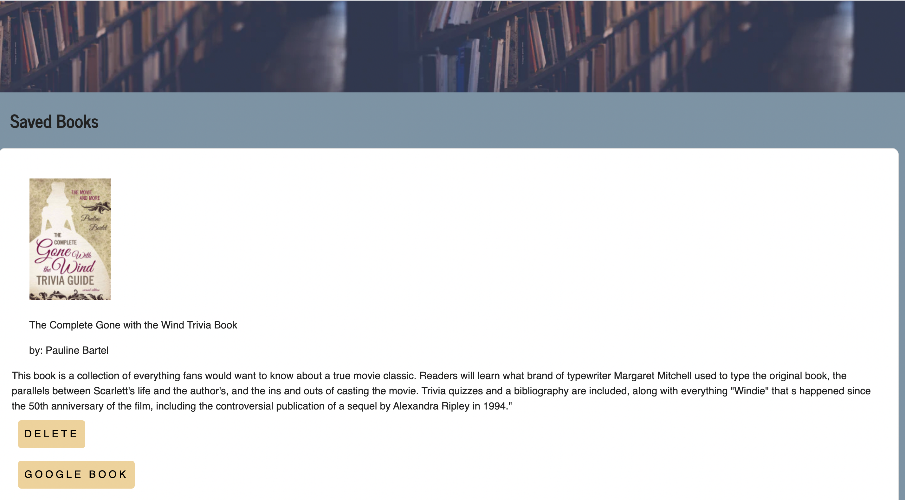

#       Google Book Search

#       Description

This application allows the user to search for book titles using the the [www.googleapis.com](www.googleapis.com) API url. Once the user has submitted the title of their search, all the volumes of that specific title are rendered to the page. Each card displays titile, image, author, description, and a link to more information about that book. The user can save their favorites to a separate page that can be viewed at a later time. When the user no longer wishes to save the book, they can simply delete it.

#       Images

#       Technologies 

* React
* create-react-app
* react-router-dom
* Axios
* Node.js
* Mongoose
* Express
* CSS

#       Contributors 

* Marisa Hanna

#       Link To Live Application

